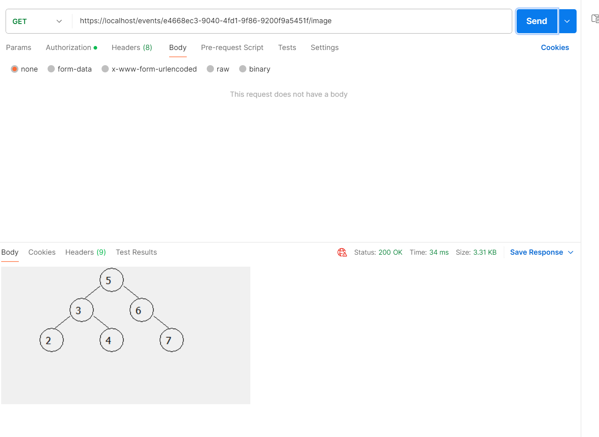

# Modsen-Events
This is a complete solution of Events test task.
--------------------------------------------------

Deployment guide:

1. Make sure your device is connected to the Internet (docker-images taken from docker-hub)
2. (First time run) docker-compose build --parallel
3. docker-compose up -d 
The application has now been successfully deployed to a Docker container and is ready to process requests.

P.S 
There might be an issue if something has already occupied :443 port (proxy nginx is used as entry point to the app services) on Windows 10.
In my case Docker allowed nginx to start up on port 443 and requests couldn't reach it because they were sent to another app.

Valid request examples and server answers for each service are listed below

~~~~~~~~~~~~~~~~~~~~~~~~~~~~~~~~~~~~~~~~~~~~~~~~~~
Auth service

Login:

Register:

Refresh:

--------------------------------------------------

Data service

Create event:

Update event:

Get event by name:

Get event by id:

Get events (paged):

Get events (paged, by criteria):

Save image:

Get image: 

Register participant:

Get participant by id:

Get event participants (paged):

Delete event:

